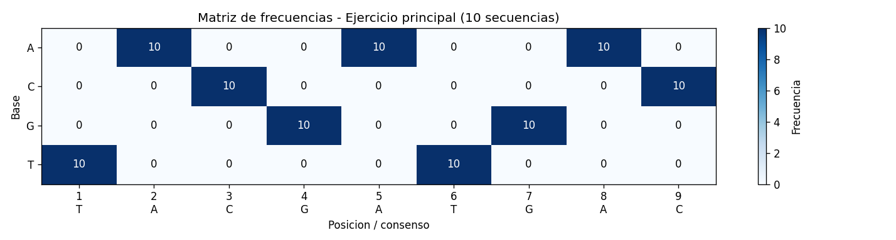
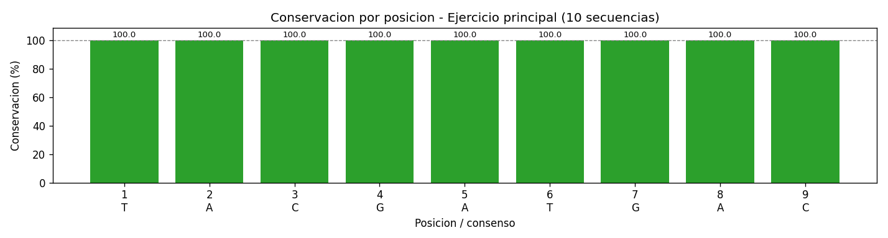
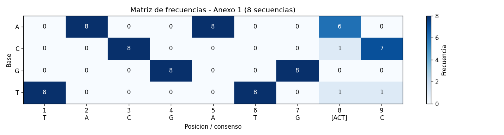
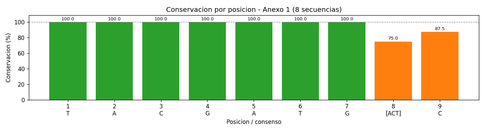

# Laboratorio 8 - Descubrimiento de Motifs

**Curso:** Bioinformatica - Escuela Profesional de Ciencia de la Computacion (UNSA)

## 1. Objetivo

Analizar conjuntos de secuencias de ADN para identificar un **motif conservado**:
una subsecuencia corta que aparece de forma recurrente y que suele asociarse a una
funcion biologica. El procedimiento sigue los pasos del laboratorio: seleccionar
k-mers candidatos, localizar sus ocurrencias, extraer la region comun, alinearla,
construir la matriz de frecuencias, derivar la secuencia consenso, evaluar la
conservacion y reportar el motif.

El core esta implementado en C++ (`motif_discovery.cpp`) y las visualizaciones e
informe HTML en Python (`visualizar.py`).

## 2. Metodologia

### Lectura de secuencias
Cada conjunto se lee desde un archivo FASTA (`data/ejercicio1.fasta` y
`data/anexo1.fasta`). Las bases se pasan a mayusculas y se filtran a `{A,C,G,T}`.

### Seleccion de k-mers candidatos (k = 7, 8, 9)
Para cada k se cuenta cada k-mer con una **ventana deslizante** y se calculan dos
metricas:

- **total**: numero de apariciones sumando todas las secuencias.
- **cobertura**: numero de secuencias distintas en las que aparece.

Se reportan dos rankings:

1. **Ranking ingenuo** (por frecuencia total). En secuencias con mucho ruido
   repetido (Anexo 1) este ranking lo dominan los repetidos de fondo, **no** el
   motif.
2. **Ranking discriminante**. Un motif conservado tiende a aparecer **~una vez por
   secuencia en (casi) todas las secuencias**, mientras que un repetido de fondo
   aparece muchas veces dentro de cada secuencia. Por eso se filtran los k-mers con
   media de apariciones por secuencia `total/cobertura <= 1.5` y se ordenan por
   cobertura (mas secuencias primero). Este ranking aisla el motif.

### Ancla, extraccion y longitud del motif
El nucleo conservado (k = 7) sirve de **ancla** para ubicar el motif en cada
secuencia. El ancla elegida es la de mayor cobertura y, a igualdad, la que aparece
mas a la izquierda en promedio: en ambos conjuntos resulta `TACGATG`. La longitud
del motif se determina extendiendo el ancla hacia la derecha mientras el prefijo
conservado siga apareciendo en al menos 2 secuencias (limite k = 9): en ambos
conjuntos da **longitud 9**. Se extrae de cada secuencia la ventana de longitud 9 a
partir del ancla, conservando las variantes (mutaciones puntuales).

### Matriz de frecuencias y consenso
Por cada posicion del alineamiento se cuentan A, C, G y T. El consenso elige la base
mas frecuente por posicion; cuando una columna presenta **3 o mas bases distintas**
se usa notacion degenerada entre corchetes (p. ej. `[ACT]`). Esta convencion
reproduce el consenso `TACGATG[ACT]C` del marco teorico.

### Conservacion
La conservacion de una posicion es `100 * (base mas frecuente) / (numero de
secuencias)`. La conservacion global es el promedio de las posiciones.

## 3. Resultados - Ejercicio principal (10 secuencias)

**Paso 2 - k-mers candidatos.** Como las secuencias son cortas y limpias, el ranking
ingenuo y el discriminante coinciden. Los k-mers de mayor cobertura (10/10) provienen
todos de la misma region: para k = 7 son `TACGATG`, `ACGATGA`, `CGATGAC`; para k = 9
el candidato es `TACGATGAC` (10/10).

**Paso 3 - Ocurrencias.** El ancla `TACGATG` aparece en las 10 secuencias en la
posicion 4 (base 0). Rango `[4, 4]`: ocurrencias en regiones identicas.

**Paso 4 y 5 - Extraccion y alineamiento.** La region extraida (longitud 9) es
`TACGATGAC` en las 10 secuencias; las 9 columnas estan totalmente conservadas.

**Paso 6 y 7 - Matriz de frecuencias y consenso.**

| Pos | A | C | G | T | Consenso |
|-----|---|---|---|---|----------|
| 1 | 0 | 0 | 0 | 10 | T |
| 2 | 10 | 0 | 0 | 0 | A |
| 3 | 0 | 10 | 0 | 0 | C |
| 4 | 0 | 0 | 10 | 0 | G |
| 5 | 10 | 0 | 0 | 0 | A |
| 6 | 0 | 0 | 0 | 10 | T |
| 7 | 0 | 0 | 10 | 0 | G |
| 8 | 10 | 0 | 0 | 0 | A |
| 9 | 0 | 10 | 0 | 0 | C |

**Secuencia consenso: `TACGATGAC`**

**Paso 8 - Conservacion.** Todas las posiciones al 100 %. **Conservacion global:
100.0 %.** No hay posiciones variables.

**Paso 9 - Reporte del motif.** Longitud 9, consenso `TACGATGAC`, presente en
**10/10** secuencias, todas en la posicion 4.





## 4. Resultados - Anexo 1 (8 secuencias)

**Paso 2 - k-mers candidatos.** Las secuencias son largas y muy repetitivas. El
**ranking ingenuo** lo dominan repetidos de fondo (`CGTAGCT` total = 77,
`GTAGCTA` total = 75, ... todos con cobertura 8/8), que **no** son el motif. El
**ranking discriminante** aisla el motif:

| k | Candidato | Cobertura | Total |
|---|-----------|-----------|-------|
| 7 | `TACGATG` | 8/8 | 8 |
| 8 | `TACGATGA` | 6/8 | 6 |
| 9 | `TACGATGAC` | 5/8 | 5 |

Este contraste es el resultado clave del paso 2: en datos ruidosos la mayor
frecuencia bruta no identifica el motif; hay que usar la cobertura y el hecho de que
el motif aparece ~una vez por secuencia.

**Paso 3 - Ocurrencias.** El ancla `TACGATG` aparece en las 8 secuencias, pero en
posiciones dispersas (rango `[108, 125]`): el mismo motif esta embebido en distinto
contexto.

**Paso 4 y 5 - Extraccion y alineamiento.** Regiones extraidas (longitud 9):

```
S1  TACGATGAC
S2  TACGATGAC
S3  TACGATGAT
S4  TACGATGAC
S5  TACGATGTC
S6  TACGATGAC
S7  TACGATGCC
S8  TACGATGAC
    *******    <- columnas 1-7 conservadas; 8 y 9 variables
```

**Paso 6 y 7 - Matriz de frecuencias y consenso.**

| Pos | A | C | G | T | Consenso |
|-----|---|---|---|---|----------|
| 1 | 0 | 0 | 0 | 8 | T |
| 2 | 8 | 0 | 0 | 0 | A |
| 3 | 0 | 8 | 0 | 0 | C |
| 4 | 0 | 0 | 8 | 0 | G |
| 5 | 8 | 0 | 0 | 0 | A |
| 6 | 0 | 0 | 0 | 8 | T |
| 7 | 0 | 0 | 8 | 0 | G |
| 8 | 6 | 1 | 0 | 1 | [ACT] |
| 9 | 0 | 7 | 0 | 1 | C |

**Secuencia consenso: `TACGATG[ACT]C`**

**Paso 8 - Conservacion.** Posiciones 1-7 al 100 %. Posicion 8: 75.0 %
(variable: A(6) C(1) T(1)). Posicion 9: 87.5 % (variable: C(7) T(1)).
**Conservacion global: 95.8 %.**

**Paso 9 - Reporte del motif.** Longitud 9, consenso `TACGATG[ACT]C`, presente en
**8/8** secuencias. Posiciones (base 0): S1=125, S2=108, S3=116, S4=116, S5=114,
S6=119, S7=116, S8=120.





## 5. Conclusiones

- Ambos conjuntos contienen el mismo motif conservado `TACGATG[ACT]C` (longitud 9),
  con un nucleo `TACGATG` totalmente conservado y variacion puntual en las posiciones
  8 y 9.
- En el ejercicio principal el motif es identico en todas las secuencias
  (conservacion global 100 %); en el Anexo 1 presenta mutaciones puntuales
  (conservacion global 95.8 %).
- La leccion metodologica del Anexo 1 es que, ante secuencias con ruido repetido, el
  k-mer mas frecuente **no** es el motif: se necesita un criterio discriminante
  (cobertura y aparicion ~una vez por secuencia) para aislarlo.

## 6. Reproduccion

```bash
g++ -std=c++17 -O2 -Wall motif_discovery.cpp -o motif
# Se pasa un archivo FASTA por ejecucion; el CSV de salida se nombra a partir de
# el (output/matriz_<nombre>.csv).
./motif data/ejercicio1.fasta
./motif data/anexo1.fasta
python3 visualizar.py   # genera los PNG y output/reporte.html
```

## 7. Codigo fuente

A continuacion se incluye el codigo completo en formato texto.

### 7.1. motif_discovery.cpp

```cpp
// ============================================================================
// Laboratorio 8 - Descubrimiento de Motifs
// Curso de Bioinformatica (EPCC - UNSA)
//
// Core del laboratorio. Implementa el pipeline completo de descubrimiento de
// motifs sobre conjuntos de secuencias de ADN:
//   1. Lectura de secuencias en formato FASTA.
//   2. Seleccion de k-mers candidatos (k = 7, 8, 9).
//   3. Localizacion de las ocurrencias de cada candidato.
//   4. Extraccion de la region conservada.
//   5. Alineamiento multiple de las regiones extraidas.
//   6. Construccion de la matriz de frecuencias.
//   7. Obtencion de la secuencia consenso.
//   8. Evaluacion del grado de conservacion.
//   9. Reporte final del motif.
//
// Procesa dos conjuntos (ejercicio principal y Anexo 1) y exporta los CSV de
// resultados a output/ para que visualizar.py genere las graficas.
// Compilar con:  g++ -std=c++17 -O2 -Wall motif_discovery.cpp -o motif
// ============================================================================

#include <iostream>
#include <fstream>
#include <string>
#include <vector>
#include <map>
#include <set>
#include <algorithm>
#include <iomanip>

using namespace std;

// Bases validas del alfabeto de ADN estandar.
const string BASES = "ACGT";

// Una secuencia leida de un archivo FASTA: su cabecera y sus bases.
struct Secuencia {
    string nombre;  // cabecera sin el caracter '>'
    string bases;   // secuencia en mayusculas, solo {A,C,G,T}
};

// Devuelve true si la base pertenece al alfabeto de ADN {A,C,G,T}.
bool esBaseValida(char c) {
    return BASES.find(c) != string::npos;
}

// Elimina de la secuencia cualquier caracter que no sea {A,C,G,T} y la pasa a
// mayusculas. Equivale a filter_valid_bases del lab_04: asi los separadores
// 'N' o caracteres ambiguos no generan k-mers artificiales mas adelante.
string filtrarBases(const string& seq) {
    string limpia;
    limpia.reserve(seq.size());
    for (char c : seq) {
        char mayus = toupper(static_cast<unsigned char>(c));
        if (esBaseValida(mayus)) {
            limpia.push_back(mayus);
        }
    }
    return limpia;
}

// Lee un archivo FASTA y devuelve todas las secuencias en orden de aparicion.
// Las lineas que empiezan con '>' son cabeceras; las lineas siguientes hasta
// la proxima '>' se concatenan como la secuencia de ese registro. Es el
// equivalente en C++ de parse_fasta del lab_04.
vector<Secuencia> leerFasta(const string& ruta) {
    ifstream archivo(ruta);
    if (!archivo.is_open()) {
        cerr << "Error: no se pudo abrir el archivo " << ruta << "\n";
        return {};
    }

    vector<Secuencia> secuencias;
    string linea;
    Secuencia actual;
    bool hayActual = false;  // indica si ya empezamos a leer un registro

    while (getline(archivo, linea)) {
        // Quitar posibles retornos de carro de archivos con saltos de Windows.
        if (!linea.empty() && linea.back() == '\r') {
            linea.pop_back();
        }
        if (linea.empty()) {
            continue;  // ignorar lineas en blanco
        }

        if (linea[0] == '>') {
            // Guardar el registro anterior antes de empezar uno nuevo.
            if (hayActual) {
                secuencias.push_back(actual);
            }
            actual = Secuencia{};
            actual.nombre = linea.substr(1);  // quitar el '>'
            hayActual = true;
        } else {
            // Acumular las bases del registro actual (ya filtradas).
            actual.bases += filtrarBases(linea);
        }
    }
    // Guardar el ultimo registro leido.
    if (hayActual) {
        secuencias.push_back(actual);
    }

    return secuencias;
}

// ----------------------------------------------------------------------------
// Paso 2 del laboratorio: identificacion de k-mers candidatos.
// ----------------------------------------------------------------------------

// Estadisticas de un k-mer dentro del conjunto de secuencias:
//   total     = numero de apariciones sumando todas las secuencias.
//   cobertura = numero de secuencias distintas en las que aparece (1..N).
struct EstadKmer {
    string kmer;
    int total = 0;
    int cobertura = 0;
};

// Cuenta todos los k-mers del conjunto con ventana deslizante (porta
// count_kmers del lab_04) y, a la vez, calcula en cuantas secuencias aparece
// cada uno. Devuelve un vector con la estadistica de cada k-mer distinto.
vector<EstadKmer> estadisticasKmers(const vector<Secuencia>& secuencias, int k) {
    map<string, int> total;
    map<string, int> cobertura;

    for (const Secuencia& s : secuencias) {
        if (k > static_cast<int>(s.bases.size())) {
            continue;  // la secuencia es mas corta que k
        }
        set<string> vistosEnEsta;  // k-mers distintos dentro de esta secuencia
        for (size_t i = 0; i + k <= s.bases.size(); ++i) {
            string km = s.bases.substr(i, k);
            total[km]++;
            vistosEnEsta.insert(km);
        }
        // Cada k-mer suma 1 a su cobertura por cada secuencia donde aparece.
        for (const string& km : vistosEnEsta) {
            cobertura[km]++;
        }
    }

    vector<EstadKmer> estad;
    estad.reserve(total.size());
    for (const auto& par : total) {
        estad.push_back(EstadKmer{par.first, par.second, cobertura[par.first]});
    }
    return estad;
}

// Ranking ingenuo: k-mers ordenados por frecuencia total (de mayor a menor).
// En secuencias con mucho ruido repetido (Anexo 1) este ranking lo dominan los
// repetidos de fondo, no el motif; por eso necesitamos tambien el discriminante.
vector<EstadKmer> rankingPorFrecuencia(vector<EstadKmer> estad) {
    sort(estad.begin(), estad.end(), [](const EstadKmer& a, const EstadKmer& b) {
        if (a.total != b.total) return a.total > b.total;
        return a.kmer < b.kmer;
    });
    return estad;
}

// Ranking discriminante para motifs. Un motif conservado tiende a aparecer
// ~una vez por secuencia en (casi) todas las secuencias, mientras que un
// repetido de fondo aparece muchas veces dentro de cada secuencia. Por eso:
//   1) nos quedamos solo con k-mers cuya media de apariciones por secuencia
//      donde aparecen (total/cobertura) sea <= 1.5, y
//   2) los ordenamos por cobertura (mas secuencias primero) y, a igual
//      cobertura, por menor total (mas "limpio", una vez por secuencia).
vector<EstadKmer> rankingDiscriminante(vector<EstadKmer> estad) {
    vector<EstadKmer> filtrados;
    for (const EstadKmer& e : estad) {
        double mediaPorSeq = static_cast<double>(e.total) / e.cobertura;
        if (mediaPorSeq <= 1.5) {
            filtrados.push_back(e);
        }
    }
    sort(filtrados.begin(), filtrados.end(),
         [](const EstadKmer& a, const EstadKmer& b) {
             if (a.cobertura != b.cobertura) return a.cobertura > b.cobertura;
             if (a.total != b.total) return a.total < b.total;
             return a.kmer < b.kmer;
         });
    return filtrados;
}

// Selecciona el k-mer candidato a motif: el mejor del ranking discriminante.
EstadKmer seleccionarCandidato(const vector<Secuencia>& secuencias, int k) {
    vector<EstadKmer> disc = rankingDiscriminante(estadisticasKmers(secuencias, k));
    if (disc.empty()) {
        return EstadKmer{};
    }
    return disc.front();
}

// Imprime, para un valor de k, los dos rankings y el candidato elegido.
void mostrarCandidatos(const vector<Secuencia>& secuencias, int k, int topN) {
    vector<EstadKmer> estad = estadisticasKmers(secuencias, k);
    vector<EstadKmer> porFrec = rankingPorFrecuencia(estad);
    vector<EstadKmer> disc = rankingDiscriminante(estad);
    int n = static_cast<int>(secuencias.size());

    cout << "  --- k = " << k << " ---\n";
    cout << "  Top por frecuencia total (ranking ingenuo):\n";
    for (int i = 0; i < topN && i < static_cast<int>(porFrec.size()); ++i) {
        cout << "    " << porFrec[i].kmer << "  total=" << porFrec[i].total
             << "  cobertura=" << porFrec[i].cobertura << "/" << n << "\n";
    }
    cout << "  Top discriminante (~1 vez por secuencia, mayor cobertura):\n";
    for (int i = 0; i < topN && i < static_cast<int>(disc.size()); ++i) {
        cout << "    " << disc[i].kmer << "  cobertura=" << disc[i].cobertura
             << "/" << n << "  total=" << disc[i].total << "\n";
    }
    if (!disc.empty()) {
        cout << "  -> Candidato a motif: " << disc.front().kmer
             << " (en " << disc.front().cobertura << "/" << n << " secuencias)\n";
    }
}

// ----------------------------------------------------------------------------
// Paso 3 del laboratorio: localizacion de las ocurrencias.
// ----------------------------------------------------------------------------

// Devuelve todas las posiciones (indice base 0) donde aparece 'patron' dentro
// de 'secuencia'. Una lista vacia significa que no aparece.
vector<int> todasPosiciones(const string& patron, const string& secuencia) {
    vector<int> posiciones;
    if (patron.empty()) return posiciones;
    size_t desde = 0;
    while (true) {
        size_t p = secuencia.find(patron, desde);
        if (p == string::npos) break;
        posiciones.push_back(static_cast<int>(p));
        desde = p + 1;  // permitir solapamientos
    }
    return posiciones;
}

// Devuelve la primera posicion de 'patron' en 'secuencia', o -1 si no aparece.
int primeraPosicion(const string& patron, const string& secuencia) {
    size_t p = secuencia.find(patron);
    return (p == string::npos) ? -1 : static_cast<int>(p);
}

// Selecciona el k-mer ancla (k = 7) que sirve de nucleo conservado para
// localizar el motif. Criterio: maxima cobertura (presente en mas secuencias)
// y, a igualdad de cobertura, el que aparece mas a la izquierda en promedio,
// porque ese nucleo marca el inicio del motif y la region se extiende hacia la
// derecha. En ambos conjuntos esto selecciona TACGATG.
string seleccionarAncla(const vector<Secuencia>& secuencias) {
    vector<EstadKmer> disc = rankingDiscriminante(estadisticasKmers(secuencias, 7));
    if (disc.empty()) return "";

    int maxCobertura = disc.front().cobertura;  // ya viene ordenado por cobertura
    string ancla;
    double mejorPosMedia = 1e18;

    for (const EstadKmer& e : disc) {
        if (e.cobertura != maxCobertura) continue;
        // Posicion media de la primera ocurrencia en las secuencias donde aparece.
        long sumaPos = 0;
        int conteo = 0;
        for (const Secuencia& s : secuencias) {
            int p = primeraPosicion(e.kmer, s.bases);
            if (p >= 0) { sumaPos += p; ++conteo; }
        }
        double media = (conteo > 0) ? static_cast<double>(sumaPos) / conteo : 1e18;
        if (media < mejorPosMedia) {
            mejorPosMedia = media;
            ancla = e.kmer;
        }
    }
    return ancla;
}

// Imprime, para el ancla elegida, su posicion en cada secuencia y comprueba si
// las ocurrencias caen en regiones similares.
void mostrarOcurrencias(const vector<Secuencia>& secuencias, const string& ancla) {
    cout << "  Ancla conservada (nucleo del motif): " << ancla << "\n";
    cout << "  Posicion (base 0) de la ocurrencia en cada secuencia:\n";
    int presentes = 0, minPos = 1e9, maxPos = -1;
    for (const Secuencia& s : secuencias) {
        vector<int> pos = todasPosiciones(ancla, s.bases);
        cout << "    " << s.nombre << ": ";
        if (pos.empty()) {
            cout << "(no aparece)";
        } else {
            for (size_t i = 0; i < pos.size(); ++i) {
                cout << pos[i] << (i + 1 < pos.size() ? ", " : "");
            }
            ++presentes;
            minPos = min(minPos, pos.front());
            maxPos = max(maxPos, pos.front());
        }
        cout << "\n";
    }
    cout << "  Aparece en " << presentes << "/" << secuencias.size()
         << " secuencias. Rango de la primera posicion: [" << minPos << ", "
         << maxPos << "]";
    if (maxPos - minPos <= 5) {
        cout << " -> ocurrencias en regiones muy similares.\n";
    } else {
        cout << " -> posiciones dispersas (motif embebido en distinto contexto).\n";
    }
}

// ----------------------------------------------------------------------------
// Pasos 4 y 5 del laboratorio: extraccion de la region conservada y
// alineamiento multiple.
// ----------------------------------------------------------------------------

// Una region del motif extraida de una secuencia concreta.
struct Region {
    string nombre;  // secuencia de origen
    int posicion;   // posicion (base 0) donde empieza la region
    string bases;   // subsecuencia extraida (longitud = longitud del motif)
};

// Determina la longitud del motif extendiendo el ancla hacia la derecha. Se
// agrega una base mas mientras exista un k-mer que tenga el ancla como prefijo
// y siga apareciendo en al menos 2 secuencias (sigue conservado). Se limita a
// k = 9 porque el laboratorio prueba k = 7, 8 y 9. En ambos conjuntos da 9.
int determinarLongitudMotif(const vector<Secuencia>& secuencias,
                            const string& ancla, int maxK = 9) {
    int L = static_cast<int>(ancla.size());
    for (int k = L + 1; k <= maxK; ++k) {
        vector<EstadKmer> estad = estadisticasKmers(secuencias, k);
        int mejorCobertura = 0;
        for (const EstadKmer& e : estad) {
            // El k-mer debe empezar exactamente con el ancla (extension a la derecha).
            if (e.kmer.compare(0, ancla.size(), ancla) == 0) {
                mejorCobertura = max(mejorCobertura, e.cobertura);
            }
        }
        if (mejorCobertura >= 2) {
            L = k;  // el prefijo conservado sigue presente, extendemos
        } else {
            break;  // ya no esta conservado, detenemos la extension
        }
    }
    return L;
}

// Extrae de cada secuencia la region del motif: ubica el ancla y toma una
// ventana de longitud 'longitud' a partir de ahi. Se conservan las variantes
// (no se corrigen las mutaciones puntuales). Las secuencias donde el ancla no
// aparece, o donde la ventana se saldria del limite, se omiten.
vector<Region> extraerRegiones(const vector<Secuencia>& secuencias,
                               const string& ancla, int longitud) {
    vector<Region> regiones;
    for (const Secuencia& s : secuencias) {
        int p = primeraPosicion(ancla, s.bases);
        if (p < 0) continue;
        if (p + longitud > static_cast<int>(s.bases.size())) continue;
        regiones.push_back(Region{s.nombre, p, s.bases.substr(p, longitud)});
    }
    return regiones;
}

// Imprime las regiones extraidas apiladas (alineamiento multiple por columnas)
// con una linea de marcas: '*' si la columna esta totalmente conservada y ' '
// si presenta variacion entre las secuencias.
void mostrarAlineamiento(const vector<Region>& regiones) {
    if (regiones.empty()) return;
    int L = static_cast<int>(regiones.front().bases.size());

    for (const Region& r : regiones) {
        cout << "    " << r.nombre << "\t" << r.bases << "\n";
    }
    // Linea de conservacion por columna.
    cout << "    conserv.\t";
    for (int col = 0; col < L; ++col) {
        char base = regiones.front().bases[col];
        bool conservada = true;
        for (const Region& r : regiones) {
            if (r.bases[col] != base) { conservada = false; break; }
        }
        cout << (conservada ? '*' : ' ');
    }
    cout << "\n";
}

// ----------------------------------------------------------------------------
// Pasos 6 y 7 del laboratorio: matriz de frecuencias y secuencia consenso.
// ----------------------------------------------------------------------------

// Matriz de frecuencias por posicion. conteo[pos] guarda el numero de
// apariciones de A, C, G y T (en ese orden) en esa columna del alineamiento.
struct MatrizFrecuencias {
    int L = 0;                      // longitud del motif (numero de columnas)
    int numSecuencias = 0;          // numero de regiones alineadas (filas)
    vector<vector<int>> conteo;     // conteo[L][4], orden de bases = "ACGT"
};

// Indice de una base dentro del orden "ACGT" (0..3), o -1 si no es valida.
int indiceBase(char c) {
    size_t p = BASES.find(c);
    return (p == string::npos) ? -1 : static_cast<int>(p);
}

// Construye la matriz de frecuencias contando, por cada posicion del
// alineamiento, cuantas veces aparece cada nucleotido.
MatrizFrecuencias matrizFrecuencias(const vector<Region>& regiones) {
    MatrizFrecuencias m;
    if (regiones.empty()) return m;
    m.L = static_cast<int>(regiones.front().bases.size());
    m.numSecuencias = static_cast<int>(regiones.size());
    m.conteo.assign(m.L, vector<int>(4, 0));

    for (const Region& r : regiones) {
        for (int col = 0; col < m.L; ++col) {
            int idx = indiceBase(r.bases[col]);
            if (idx >= 0) m.conteo[col][idx]++;
        }
    }
    return m;
}

// Imprime la matriz de frecuencias como una tabla posicion x {A,C,G,T}.
void mostrarMatriz(const MatrizFrecuencias& m) {
    cout << "    Pos\tA\tC\tG\tT\n";
    for (int col = 0; col < m.L; ++col) {
        cout << "    " << (col + 1);
        for (int b = 0; b < 4; ++b) cout << "\t" << m.conteo[col][b];
        cout << "\n";
    }
}

// Obtiene la secuencia consenso. Por cada posicion se elige la base mas
// frecuente. Cuando la columna presenta 3 o mas bases distintas (variabilidad
// real) se usa notacion degenerada entre corchetes con todas las bases
// observadas, p. ej. [ACT]; con una sola base se reporta esa base y con dos
// (mutacion puntual) se reporta la mas frecuente. Esta convencion reproduce el
// consenso TACGATG[ACT]C del marco teorico.
string consenso(const MatrizFrecuencias& m) {
    string resultado;
    for (int col = 0; col < m.L; ++col) {
        int distintas = 0, mejorBase = 0, mejorConteo = -1;
        for (int b = 0; b < 4; ++b) {
            if (m.conteo[col][b] > 0) distintas++;
            if (m.conteo[col][b] > mejorConteo) {
                mejorConteo = m.conteo[col][b];
                mejorBase = b;
            }
        }
        if (distintas >= 3) {
            string grupo = "[";
            for (int b = 0; b < 4; ++b) {
                if (m.conteo[col][b] > 0) grupo += BASES[b];
            }
            grupo += "]";
            resultado += grupo;
        } else {
            resultado += BASES[mejorBase];
        }
    }
    return resultado;
}

// ----------------------------------------------------------------------------
// Pasos 8 y 9 del laboratorio: evaluacion de la conservacion y reporte del motif.
// ----------------------------------------------------------------------------

// Porcentaje de conservacion de cada posicion: frecuencia de la base mas comun
// dividida entre el numero de secuencias, en porcentaje (0..100).
vector<double> conservacionPorPosicion(const MatrizFrecuencias& m) {
    vector<double> pct(m.L, 0.0);
    for (int col = 0; col < m.L; ++col) {
        int mejor = 0;
        for (int b = 0; b < 4; ++b) mejor = max(mejor, m.conteo[col][b]);
        pct[col] = m.numSecuencias > 0
                       ? 100.0 * mejor / m.numSecuencias
                       : 0.0;
    }
    return pct;
}

// Conservacion global del motif: promedio de la conservacion de sus posiciones.
double conservacionGlobal(const vector<double>& pct) {
    if (pct.empty()) return 0.0;
    double suma = 0.0;
    for (double v : pct) suma += v;
    return suma / pct.size();
}

// Devuelve las bases observadas en una columna como texto, p. ej. "A(6) C(1) T(1)".
string basesObservadas(const MatrizFrecuencias& m, int col) {
    string s;
    for (int b = 0; b < 4; ++b) {
        if (m.conteo[col][b] > 0) {
            if (!s.empty()) s += " ";
            s += string(1, BASES[b]) + "(" + to_string(m.conteo[col][b]) + ")";
        }
    }
    return s;
}

// Imprime el porcentaje de conservacion por posicion, las posiciones totalmente
// conservadas (100%), las variables (con sus bases) y la conservacion global.
void mostrarConservacion(const MatrizFrecuencias& m) {
    vector<double> pct = conservacionPorPosicion(m);
    cout << "    Conservacion por posicion:\n";
    for (int col = 0; col < m.L; ++col) {
        cout << "      Pos " << (col + 1) << ": " << fixed << setprecision(1)
             << pct[col] << "%";
        if (pct[col] < 100.0) {
            cout << "  (variable: " << basesObservadas(m, col) << ")";
        }
        cout << "\n";
    }

    cout << "    Posiciones totalmente conservadas (100%): ";
    bool primera = true;
    for (int col = 0; col < m.L; ++col) {
        if (pct[col] >= 100.0) {
            cout << (primera ? "" : ", ") << (col + 1);
            primera = false;
        }
    }
    cout << "\n";

    cout << "    Posiciones variables: ";
    primera = true;
    for (int col = 0; col < m.L; ++col) {
        if (pct[col] < 100.0) {
            cout << (primera ? "" : ", ") << (col + 1);
            primera = false;
        }
    }
    if (primera) cout << "(ninguna)";
    cout << "\n";

    cout << "    Conservacion global del motif: " << fixed << setprecision(1)
         << conservacionGlobal(pct) << "%\n";
}

// Imprime el reporte final del motif: longitud, consenso, posicion en cada
// secuencia y numero de secuencias que lo contienen.
void reportarMotif(const vector<Region>& regiones, const MatrizFrecuencias& m,
                   int numTotalSecuencias) {
    cout << "    Longitud del motif: " << m.L << "\n";
    cout << "    Secuencia consenso: " << consenso(m) << "\n";
    cout << "    Secuencias que contienen el motif: " << regiones.size() << "/"
         << numTotalSecuencias << "\n";
    cout << "    Posicion del motif en cada secuencia (base 0):\n";
    for (const Region& r : regiones) {
        cout << "      " << r.nombre << ": " << r.posicion << "  (" << r.bases
             << ")\n";
    }
}

// ----------------------------------------------------------------------------
// Exportacion de resultados a CSV (para las visualizaciones en Python).
// ----------------------------------------------------------------------------

// Devuelve el token de consenso de cada posicion por separado, p. ej.
// {"T","A","C","G","A","T","G","[ACT]","C"}. Reutiliza la misma logica que
// consenso() pero columna por columna.
vector<string> consensoPorPosicion(const MatrizFrecuencias& m) {
    vector<string> tokens;
    for (int col = 0; col < m.L; ++col) {
        int distintas = 0, mejorBase = 0, mejorConteo = -1;
        for (int b = 0; b < 4; ++b) {
            if (m.conteo[col][b] > 0) distintas++;
            if (m.conteo[col][b] > mejorConteo) {
                mejorConteo = m.conteo[col][b];
                mejorBase = b;
            }
        }
        if (distintas >= 3) {
            string grupo = "[";
            for (int b = 0; b < 4; ++b)
                if (m.conteo[col][b] > 0) grupo += BASES[b];
            grupo += "]";
            tokens.push_back(grupo);
        } else {
            tokens.push_back(string(1, BASES[mejorBase]));
        }
    }
    return tokens;
}

// Escribe la matriz de frecuencias a un CSV con una fila por posicion:
// posicion,A,C,G,T,consenso,conservacion. Lo consume visualizar.py.
void exportarMatrizCSV(const MatrizFrecuencias& m, const string& ruta) {
    ofstream out(ruta);
    if (!out.is_open()) {
        cerr << "Error: no se pudo escribir " << ruta << "\n";
        return;
    }
    vector<double> pct = conservacionPorPosicion(m);
    vector<string> tokens = consensoPorPosicion(m);
    out << "posicion,A,C,G,T,consenso,conservacion\n";
    for (int col = 0; col < m.L; ++col) {
        out << (col + 1);
        for (int b = 0; b < 4; ++b) out << "," << m.conteo[col][b];
        out << "," << tokens[col] << ","
            << fixed << setprecision(1) << pct[col] << "\n";
    }
}

// ----------------------------------------------------------------------------
// Pipeline completo: ejecuta los 9 pasos sobre un conjunto de secuencias,
// imprime el reporte y exporta el CSV de resultados.
// ----------------------------------------------------------------------------
void procesarConjunto(const string& titulo, const string& rutaFasta,
                      const string& rutaCSV) {
    vector<Secuencia> secuencias = leerFasta(rutaFasta);
    cout << "============================================================\n";
    cout << titulo << "  (" << secuencias.size() << " secuencias, archivo "
         << rutaFasta << ")\n";
    cout << "============================================================\n";

    if (secuencias.empty()) {
        cout << "No se leyeron secuencias; se omite el conjunto.\n\n";
        return;
    }

    // Paso 2: k-mers candidatos para k = 7, 8 y 9.
    cout << "[Paso 2] Identificacion de k-mers candidatos\n";
    for (int k : {7, 8, 9}) {
        mostrarCandidatos(secuencias, k, 5);
    }
    cout << "\n";

    // Paso 3: localizacion de ocurrencias del ancla conservada.
    string ancla = seleccionarAncla(secuencias);
    cout << "[Paso 3] Localizacion de ocurrencias\n";
    mostrarOcurrencias(secuencias, ancla);
    cout << "\n";

    // Paso 4: extraccion de la region conservada.
    int L = determinarLongitudMotif(secuencias, ancla);
    vector<Region> regiones = extraerRegiones(secuencias, ancla, L);
    cout << "[Paso 4] Extraccion de la region conservada (longitud " << L << ")\n";
    for (const Region& r : regiones) {
        cout << "    " << r.nombre << " (pos " << r.posicion << "): "
             << r.bases << "\n";
    }
    cout << "\n";

    // Paso 5: alineamiento multiple.
    cout << "[Paso 5] Alineamiento multiple de las regiones\n";
    mostrarAlineamiento(regiones);
    cout << "\n";

    // Pasos 6 y 7: matriz de frecuencias y consenso.
    MatrizFrecuencias m = matrizFrecuencias(regiones);
    cout << "[Paso 6] Matriz de frecuencias\n";
    mostrarMatriz(m);
    cout << "[Paso 7] Secuencia consenso: " << consenso(m) << "\n\n";

    // Pasos 8 y 9: conservacion y reporte final.
    cout << "[Paso 8] Evaluacion del grado de conservacion\n";
    mostrarConservacion(m);
    cout << "\n[Paso 9] Reporte del motif encontrado\n";
    reportarMotif(regiones, m, static_cast<int>(secuencias.size()));
    cout << "\n";

    // Exportar resultados para las visualizaciones.
    exportarMatrizCSV(m, rutaCSV);
    cout << "Matriz exportada a: " << rutaCSV << "\n\n";
}

// Extrae el identificador de un archivo: nombre base sin directorio ni
// extension. Ejemplo: "data/anexo1.fasta" -> "anexo1". Sirve para nombrar el
// CSV de salida a partir del archivo de entrada.
string identificadorArchivo(const string& ruta) {
    size_t inicio = ruta.find_last_of("/\\");
    inicio = (inicio == string::npos) ? 0 : inicio + 1;
    size_t fin = ruta.find_last_of('.');
    if (fin == string::npos || fin < inicio) fin = ruta.size();
    return ruta.substr(inicio, fin - inicio);
}

int main(int argc, char* argv[]) {
    // El programa recibe exactamente un archivo FASTA con las secuencias a
    // analizar. El CSV de salida se nombra a partir del archivo de entrada
    // (output/matriz_<nombre>.csv).
    if (argc != 2) {
        cerr << "Uso: " << argv[0] << " <archivo.fasta>\n";
        return 1;
    }

    string ruta = argv[1];
    string id = identificadorArchivo(ruta);
    string titulo = id;
    transform(titulo.begin(), titulo.end(), titulo.begin(),
              [](unsigned char c) { return toupper(c); });
    string rutaCSV = "output/matriz_" + id + ".csv";
    procesarConjunto(titulo, ruta, rutaCSV);
    return 0;
}
```

### 7.2. visualizar.py

```python
#!/usr/bin/env python3
"""
visualizar.py - Visualizaciones del Laboratorio 8 (Descubrimiento de Motifs).

Lee los CSV que genera el core en C++ (output/matriz_*.csv) y produce, para cada
conjunto de secuencias:
  - un heatmap de la matriz de frecuencias (posicion x {A,C,G,T}),
  - un grafico de barras del porcentaje de conservacion por posicion, y
  - un informe HTML autocontenido (output/reporte.html) con las imagenes
    embebidas en base64 (sin enlaces externos) y las tablas de resultados.

Uso:
    python3 visualizar.py
"""

import base64
import csv
import os

import matplotlib
matplotlib.use("Agg")  # backend sin ventana: solo escribe archivos PNG
import matplotlib.pyplot as plt
import numpy as np

# Carpeta donde el core deja los CSV y donde dejaremos las imagenes/HTML.
DIR_SALIDA = "output"

# Orden de bases usado en toda la matriz (coincide con el core en C++).
BASES = ["A", "C", "G", "T"]

# Conjuntos a visualizar: (id, titulo legible, ruta del CSV).
CONJUNTOS = [
    ("ejercicio1", "Ejercicio principal (10 secuencias)",
     os.path.join(DIR_SALIDA, "matriz_ejercicio1.csv")),
    ("anexo1", "Anexo 1 (8 secuencias)",
     os.path.join(DIR_SALIDA, "matriz_anexo1.csv")),
]


def leer_matriz(ruta):
    """Lee un CSV de matriz de frecuencias y devuelve una lista de filas (dict).

    Cada fila tiene: posicion (int), A/C/G/T (int), consenso (str),
    conservacion (float).
    """
    filas = []
    with open(ruta, newline="") as f:
        for fila in csv.DictReader(f):
            filas.append({
                "posicion": int(fila["posicion"]),
                "A": int(fila["A"]),
                "C": int(fila["C"]),
                "G": int(fila["G"]),
                "T": int(fila["T"]),
                "consenso": fila["consenso"],
                "conservacion": float(fila["conservacion"]),
            })
    return filas


def consenso_completo(filas):
    """Concatena los tokens de consenso por posicion (p. ej. TACGATG[ACT]C)."""
    return "".join(fila["consenso"] for fila in filas)


def heatmap_frecuencias(filas, titulo, ruta_png):
    """Genera el heatmap de la matriz de frecuencias y lo guarda como PNG."""
    posiciones = [fila["posicion"] for fila in filas]
    # Matriz 4 x L: filas = bases, columnas = posiciones.
    matriz = np.array([[fila[b] for fila in filas] for b in BASES])

    fig, ax = plt.subplots(figsize=(1.1 * len(posiciones) + 2, 3.2))
    im = ax.imshow(matriz, cmap="Blues", aspect="auto")

    # Etiquetas de ejes.
    ax.set_xticks(range(len(posiciones)))
    etiquetas_x = [f"{p}\n{fila['consenso']}" for p, fila in zip(posiciones, filas)]
    ax.set_xticklabels(etiquetas_x)
    ax.set_yticks(range(len(BASES)))
    ax.set_yticklabels(BASES)
    ax.set_xlabel("Posicion / consenso")
    ax.set_ylabel("Base")
    ax.set_title(f"Matriz de frecuencias - {titulo}")

    # Anotar el conteo en cada celda.
    maximo = matriz.max() if matriz.size else 1
    for i in range(matriz.shape[0]):
        for j in range(matriz.shape[1]):
            valor = matriz[i, j]
            color = "white" if valor > maximo / 2 else "black"
            ax.text(j, i, str(valor), ha="center", va="center", color=color)

    fig.colorbar(im, ax=ax, label="Frecuencia")
    fig.tight_layout()
    fig.savefig(ruta_png, dpi=120)
    plt.close(fig)


def grafico_conservacion(filas, titulo, ruta_png):
    """Genera el grafico de barras de conservacion por posicion (PNG)."""
    posiciones = [fila["posicion"] for fila in filas]
    valores = [fila["conservacion"] for fila in filas]
    # Verde para posiciones totalmente conservadas, naranja para variables.
    colores = ["#2ca02c" if v >= 100.0 else "#ff7f0e" for v in valores]

    fig, ax = plt.subplots(figsize=(1.1 * len(posiciones) + 2, 3.2))
    barras = ax.bar(range(len(posiciones)), valores, color=colores)
    ax.set_xticks(range(len(posiciones)))
    ax.set_xticklabels([f"{p}\n{fila['consenso']}"
                        for p, fila in zip(posiciones, filas)])
    ax.set_ylim(0, 109)
    ax.set_ylabel("Conservacion (%)")
    ax.set_xlabel("Posicion / consenso")
    ax.set_title(f"Conservacion por posicion - {titulo}")

    # Linea de referencia del 100% y etiquetas de valor.
    ax.axhline(100, color="gray", linestyle="--", linewidth=0.8)
    for rect, v in zip(barras, valores):
        ax.text(rect.get_x() + rect.get_width() / 2, v + 1,
                f"{v:.1f}", ha="center", va="bottom", fontsize=8)

    fig.tight_layout()
    fig.savefig(ruta_png, dpi=120)
    plt.close(fig)


def png_a_base64(ruta_png):
    """Codifica un PNG en base64 para embeberlo directamente en el HTML."""
    with open(ruta_png, "rb") as f:
        return base64.b64encode(f.read()).decode("ascii")


def tabla_html(filas):
    """Construye la tabla HTML de la matriz de frecuencias y conservacion."""
    cabecera = ("<tr><th>Pos</th><th>A</th><th>C</th><th>G</th><th>T</th>"
                "<th>Consenso</th><th>Conservacion</th></tr>")
    cuerpo = ""
    for fila in filas:
        resaltado = "" if fila["conservacion"] >= 100.0 else ' class="var"'
        cuerpo += (f"<tr{resaltado}><td>{fila['posicion']}</td>"
                   f"<td>{fila['A']}</td><td>{fila['C']}</td>"
                   f"<td>{fila['G']}</td><td>{fila['T']}</td>"
                   f"<td>{fila['consenso']}</td>"
                   f"<td>{fila['conservacion']:.1f}%</td></tr>")
    return f"<table>{cabecera}{cuerpo}</table>"


def main():
    secciones = []
    for id_conj, titulo, ruta_csv in CONJUNTOS:
        if not os.path.exists(ruta_csv):
            print(f"Aviso: no existe {ruta_csv}. Ejecuta primero ./motif")
            continue

        filas = leer_matriz(ruta_csv)
        ruta_heat = os.path.join(DIR_SALIDA, f"heatmap_{id_conj}.png")
        ruta_cons = os.path.join(DIR_SALIDA, f"conservacion_{id_conj}.png")
        heatmap_frecuencias(filas, titulo, ruta_heat)
        grafico_conservacion(filas, titulo, ruta_cons)

        consenso = consenso_completo(filas)
        global_pct = sum(f["conservacion"] for f in filas) / len(filas)
        n_conservadas = sum(1 for f in filas if f["conservacion"] >= 100.0)
        print(f"{titulo}: consenso={consenso}  global={global_pct:.1f}%  "
              f"posiciones 100%={n_conservadas}/{len(filas)}")

        secciones.append(f"""
        <section>
          <h2>{titulo}</h2>
          <p><b>Secuencia consenso:</b> <code>{consenso}</code> &nbsp;|&nbsp;
             <b>Longitud:</b> {len(filas)} &nbsp;|&nbsp;
             <b>Conservacion global:</b> {global_pct:.1f}% &nbsp;|&nbsp;
             <b>Posiciones 100%:</b> {n_conservadas}/{len(filas)}</p>
          
          
          {tabla_html(filas)}
        </section>""")

    html = f"""<!DOCTYPE html>
<html lang="es">
<head>
  <meta charset="utf-8">
  <title>Laboratorio 8 - Descubrimiento de Motifs</title>
  <style>
    body {{ font-family: Arial, sans-serif; margin: 2rem; color: #222; }}
    h1 {{ color: #1f4e79; }}
    h2 {{ color: #2e6da4; border-bottom: 2px solid #ddd; padding-bottom: 4px; }}
    section {{ margin-bottom: 3rem; }}
    img {{ max-width: 100%; height: auto; display: block; margin: 1rem 0; }}
    table {{ border-collapse: collapse; margin-top: 1rem; }}
    th, td {{ border: 1px solid #ccc; padding: 4px 10px; text-align: center; }}
    th {{ background: #1f4e79; color: #fff; }}
    tr.var {{ background: #fff3e0; }}
    code {{ background: #f0f0f0; padding: 2px 6px; border-radius: 4px; }}
  </style>
</head>
<body>
  <h1>Laboratorio 8 - Descubrimiento de Motifs</h1>
  <p>Motif conservado identificado en cada conjunto de secuencias. Las filas
     resaltadas indican posiciones con variacion (mutaciones puntuales).</p>
  {''.join(secciones)}
</body>
</html>"""

    ruta_html = os.path.join(DIR_SALIDA, "reporte.html")
    with open(ruta_html, "w") as f:
        f.write(html)
    print(f"Informe HTML generado en: {ruta_html}")


if __name__ == "__main__":
    main()
```
